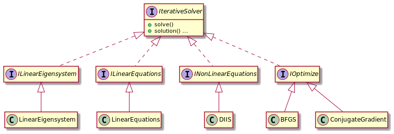
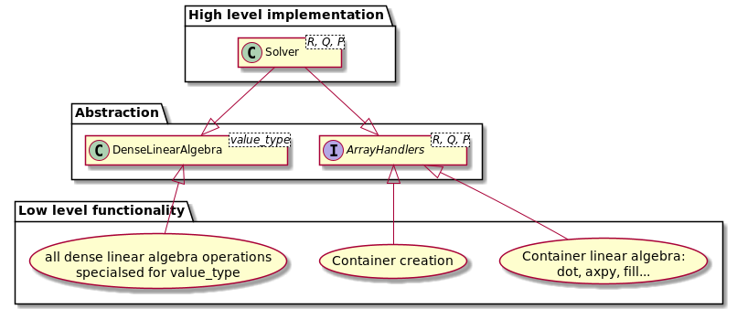

Library Design
==============

## Iterative solvers

There are 4 types of solvers. They share a very similar functionality and their common interface is expressed in
IterativeSolver base class.

Each type of solver can have multiple implementations.

Solvers are templated on container type so that the user can choose optimal container for their
problem. This requires two sets of dependency inversion. 

Firstly, dense linear algebra operations are wrapped up in ``DenseLinearAlgebra`` class,
which depends on the type of container elements.
This can be time consuming to compile so it is specialised for ``double`` and ``std::complex``.

Secondly, ``ArrayHandlers`` defines the interface for operation on containers
such as copying, linear algebra, lazy evaluation etc. ``ArrayHandlers`` is a collection
of ``ArrayHandler`` abstract classes. There are implementations of ``ArrayHandler``
for common container types, but for more specialised cases the user must provide their own.

