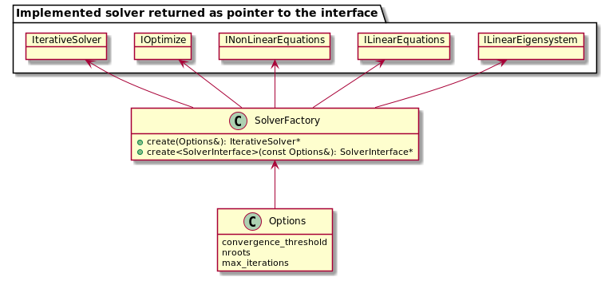

Library Design
==============

## Iterative solvers

### Solver interfaces and implementations

There are 4 types of solvers. They share a very similar functionality and their common interface is expressed in
IterativeSolver base class.

Each type of solver can have multiple implementations.

### Dependency inversion mechanism

Solvers are templated on container type so that the user can choose optimal container for their problem. This requires
two sets of dependency inversion.

Firstly, dense linear algebra operations are wrapped up in ``DenseLinearAlgebra`` class, which depends on the type of
container elements. This can be time consuming to compile so it is specialised for ``double`` and ``std::complex``.

Secondly, ``ArrayHandlers`` defines the interface for operation on containers such as copying, linear algebra, lazy
evaluation etc. ``ArrayHandlers`` is a collection of ``ArrayHandler`` abstract classes. There are implementations
of ``ArrayHandler``
for common container types, but for more specialised cases the user must provide their own.

### Setting solver Options

There are setters and getters for setting the options, but they require complete type of the object to be known. This
might not be possible if the user is working with solver through the interface. Working through the interface can be
necessary to reduce compilation time and minimize header bloat.

Instead options can be set in the `Options` class and then passed to `IterativeSolver::set_options()`
which will call setters internally. Similarly calling `IterativeSolver::get_options()` returns a pointer to
the `Options` class and the user can query their values.

Options classes are organised in a hierarchy that mirrors inheritance structure of iterative solvers (see above). At the
lowest level are options for each implementation of a solver and they contain all of the available options that can be
set, including for interface classes.

### Solver Factory

`SolverFactory` allows dynamic creation of a solver. It takes an implementation options object by reference and deduces
the corresponding solver with dynamic casts. This is the main reason why the options hierarchy mirrors that of solvers.

## Distributed Arrays

In parallel computing it is often necessary to distribute an array over multiple processes. Each process stores a
small section of the array without overlapping. There are multiple implementations of this approach including
Global Arrays, MPI3 windows, parallel HDF5 and others.
We provide a simple interface to different implementations of distributed arrays to allow cross-compatibility and
simplify their usage.

There are three aspects to consider:
1. distribution across processes and access to the local section
2. linear algebra operations that require only local sections
3. remote memory access (RMA) operations for accessing data on a different process

The distribution can be defined using molpro::linalg::array::util::Distribution and the abstract class 
molpro::linalg::array::DistrArray defines common functionality such as checking that two distributed arrays are 
compatible and accessing the local buffer.

The linear algebra operations only require local sections and can be supported by all distributed arrays. However, some
implementations can use more efficient algorithms (e.g. buffering local section in chunks when loading from disk),
so the linear algebra operations have to be virtual functions in the base class.

Not all implementation can or need to support RMA operations, however most will. We decided to make RMA operations
part of the abstract base class, even though they might not always be implemented thus breaking the Liskov substitution
principle. 
